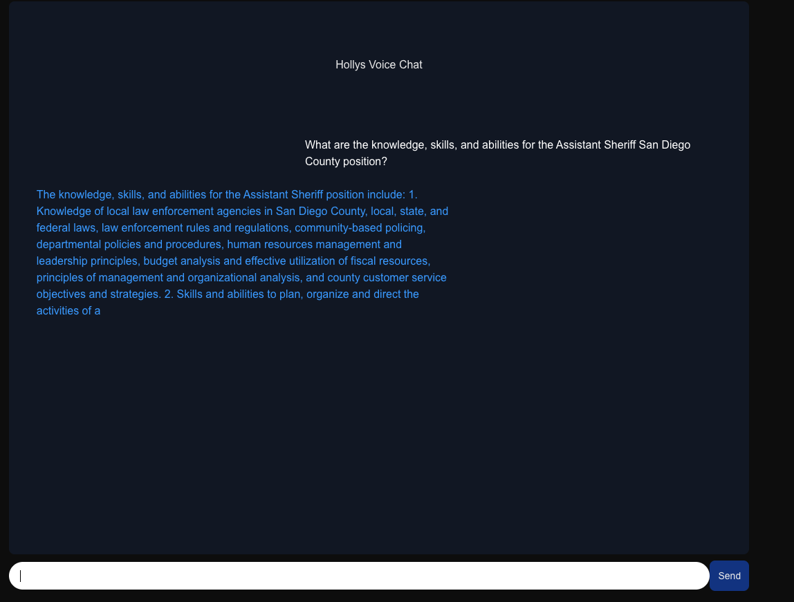
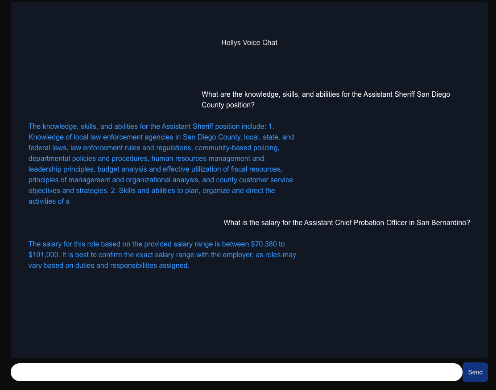

# Eshwar Tangiralas submission for Holly Engineering Take-Home Assignment

## Overview

Hello! My name is Eshwar, and below will be the documentation for the take home assignment from Holly, going over my approach, technologies used, and any challenges i faced!

## Installation and Setup

    1. Clone the repository
    ```git clone git@github.com:Eshwar1212-maker/holly-eng-take-home-Eshwar-Tangirala.git
    ```

    2. Make sure you are in the 'holly-eng-take-home-Eshwar-Tangirala.' directory. Then run 'npm install' and 'npm run dev'.

    3. Get the necessary ENV variables, I used Cohere for this project, so copy the 'NEXT_PUBLIC_COHERE_API_KEY' variable from the 'env-example', 
    create your own .env file, and go to 'https://dashboard.cohere.com/api-keys' to get your own trial key for the project. 

    Thankfully Cohere easily provides a trial key, all you have to do is go to the website after signing up and grab it!

## Approach
Here are the steps I took in order from start to finish, in terms of what I thought i should prioritize. 

1. Getting the user interface set up, I ensured I did this first so I can simply have some method of testing if the data filtering/processing function works. 

2. The data filtering/processing function I think was the most important part of the project. I ensured I took care of this before plugging in the LLM, so I 
    was sure that only the necessary date was processed(to make the LLM be faster).

3. The LLM, this was the last step, I used Cohere, and plugging it in was very simple, as it would be with any other LLM, because we took care of the last two steps, 
    all we had to do was plug in the necessary data from the filtering/sorting function, and give the prompt to the LLM. 
  
## Technologies I used

I used Cohere for the LLM. The reason I used Cohere, is its free limit is very easy to use compared to OpenAi and Hugging Face, however, any LLM would work. For data fetching,
I just used Axios, and for styling I used Tailwind CSS. 

## Challenges I faced

The main challenges I faced was regarding the choice of LLM, I initially used GPT, however, they recently got rid of their free tier limit, and after a few requests 
I was not able to use it, so thankfully I found Cohere!

## Further improvements(with more time)
Here are a few things that I think I could of improved if i had more time.

1. User interface and responsiveness.

2. Writing a reusable function for the POST request in the chat(Form component), making it reusable based off of whatever LLM the engineer would want to use, as well 
    as making the code cleaner.

3. I was going to put the <Body /> and <Form /> components both in the 'page.tsx' for better structure, instead of having the <Form/> in the body, but was short on time.

4. Other minor touch ups, some Typescript optimizations or code refactoring.

Would love to chat about these ideas with you in the next round potentially!


## Screenshots

Here are some screenshots of the working application:


